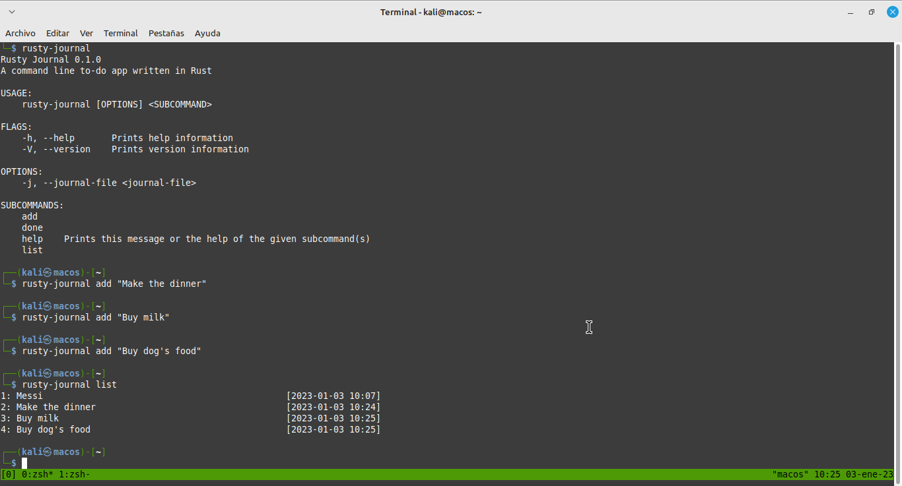
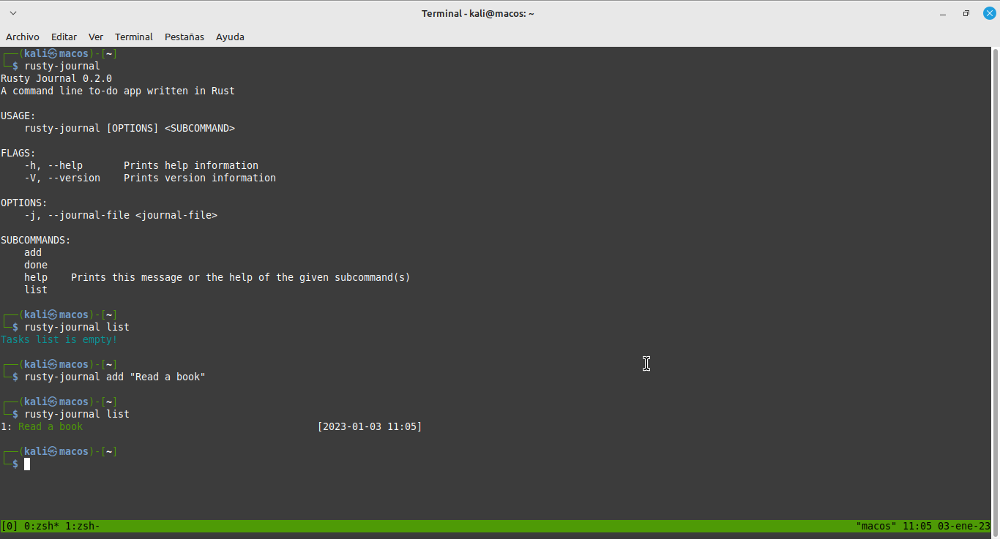

# ToDo CLI App


¡He escrito una moderna aplicación de línea de comandos de Rust!

Con la aplicación de diario, puede agregar nuevas tareas a una lista, quitar las tareas completadas e imprimir todas las tareas pendientes.

Ahora puede compilar el programa en modo de publicación y compartir el programa compilado con el mundo. Para compilar el programa, vaya al terminal y ejecute el comando:

```bash
cargo run --release.
```

El binario compilado (el archivo ejecutable) estará en el directorio `target/release/` y llevará el nombre del proyecto. Si utiliza macOS o Linux, se le llamará `rusty-journal`. Si utiliza Windows, se le llamará `rusty-journal.exe`.

Ya puede llamarlo directamente desde la línea de comandos.

Ya no necesita Cargo.

Solo tiene que asegurarse de que su directorio aparezca en la variable de entorno PATH.

> [Curso de Microsoft completado](https://learn.microsoft.com/es-es/training/achievements/learn.languages.rust-first-steps.trophy?username=Oussama-02)

## Versiones

### v0.1



### v0.2

> Se añaden algunos colores


